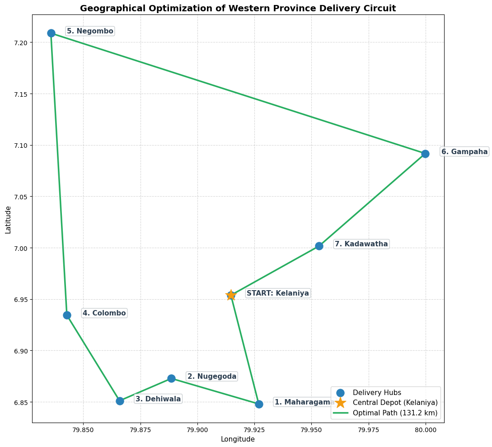

# 🚚 Smart Logistics: Western Province Delivery Route Optimization (TSP)

An applied operations research and logistics engineering project built in Python. This project models and solves the Traveling Salesperson Problem (TSP) for an express delivery fleet operating across 8 major commercial and distribution hubs in Sri Lanka's Western Province (Colombo and Gampaha districts), delivering a 41.0% reduction in route distance and over 15 Million LKR in annual fleet fuel savings.

---

## 📌 Business & Operational Problem
In urban logistics and last-mile distribution (e.g., e-commerce fulfillment, retail restocking, and courier networks), unoptimized delivery routes result in vehicle backtracking, wasted driver hours, excessive wear-and-tear, and high fuel expenditure. With commercial diesel prices at high levels in Sri Lanka, optimizing route sequencing directly protects operating margins.

---

## 🛠️ Tech Stack & Methodology
* Language: Python 3
* Libraries: pandas, numpy, matplotlib, seaborn, itertools
* Geographical Scope: Western Province, Sri Lanka (Kelaniya Depot, Colombo Fort, Nugegoda, Dehiwala, Maharagama, Kadawatha, Gampaha, Negombo)
* Spatial Distance Metric: Haversine formulation scaled for urban road network curvature
* Optimization Algorithm: Exhaustive Global Combinatorial Permutation Search across 5,040 feasible route cycles

---

## 📊 Key Results & Financial ROI

The optimizer restructured the delivery sequence into a continuous circular loop, eliminating province-wide criss-crossing:

| Metric | Unoptimized / Naive Route | Mathematically Optimal Route | Impact / Savings |
| :--- | :--- | :--- | :--- |
| **Total Route Distance** | 222.2 km | **131.2 km** | **-91.0 km (41.0% Cut)** |
| **Fuel Cost per Trip** | Rs. 12,591.33 | **Rs. 7,434.67** | **Rs. 5,156.67 saved** |
| **Annual Fuel ROI (10 Trucks)** | - | - | **Rs. 15,470,000.00 LKR / Year** |

*Assumptions: Standard urban delivery fleet fuel efficiency of 6.0 km/L at Rs. 340.00 LKR per liter of diesel across 25 operating days per month.*

---

## 🗺️ Optimal Delivery Circuit Visualization

*Start: Kelaniya Central Depot
*Stop 1: Maharagama
*Stop 2: Nugegoda
*Stop 3: Dehiwala
*Stop 4: Colombo Fort
*Stop 5: Negombo
*Stop 6: Gampaha
*Stop 7: Kadawatha
*Return: Kelaniya Central Depot

---

## 🚀 How to Run
1. Clone the repository:
   git clone https://github.com/rasindupramith-oss/western-province-logistics-route-optimizer.git
2. Run Logistics_Route_Optimizer.ipynb in Google Colab or Jupyter Notebook.

---
Author: Rasindu Pramith — Undergraduate in Applied Statistics, Faculty of Science, University of Colombo
